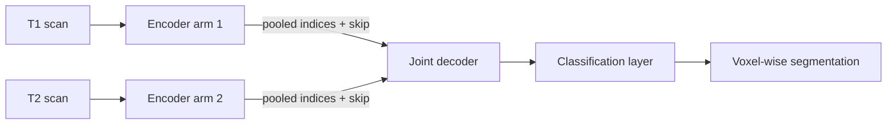

---
# ─── Required ──────────────────────────────────────────────────────────────
title: 'InfiNet: segmenting infant brain MRI at the iso-intense stage'
date: 2018-04-04

# ─── Recommended ───────────────────────────────────────────────────────────
description: >-
  Why six-month-old brains are the hardest ones to segment, and how a
  dual-encoder network with learning-free upsampling handles them.
tags: [deep-learning, medical-imaging, segmentation]
categories: [research]
image: /assets/img/publication_preview/infinet.png

# ─── Optional feature flags (all default to false unless noted) ────────────
math: true # KaTeX formulas
mermaid: true # Mermaid diagrams
toc: true # table-of-contents rail (defaults to true)
# pinned: true          # stick to the top of /blog/
# draft: true           # hide everywhere until you remove this
# lastmod: 2026-08-09   # shows an "Updated" line in the header
---

Most brain-MRI segmentation work assumes adult scans, where white matter and grey
matter separate cleanly by intensity. Infant brains around six to eight months do
not cooperate. This is the **iso-intense stage**, and it is the reason this problem
needs its own architecture.

This post walks through [InfiNet](https://ieeexplore.ieee.org/abstract/document/8363542),
published at ISBI 2018.

## The problem

During the iso-intense stage, ongoing myelination pushes white and grey matter
toward almost the same intensity profile. In T1 the contrast between the two
tissue types nearly vanishes; T2 carries complementary information, but neither
modality is sufficient alone.

So the practical constraint is: **use both modalities, and don't assume intensity
alone separates the classes.**

> TODO: add a figure showing a T1 and T2 slice side by side at this stage — it
> makes the problem obvious in a way prose can't.

## Architecture

InfiNet is a fully convolutional network with **two encoder arms** — one per input
modality — feeding a **single joint decoder**.



Keeping the encoders separate until the decoder lets each arm learn
modality-specific filters, rather than forcing early fusion on channels whose
statistics differ.

### The part that matters: learning-free upsampling

The contribution isn't the two-arm layout — it's how the decoder gets back to full
resolution.

Instead of learning transposed convolutions, each decoder block reuses the
**max-pooling indices** recorded by its corresponding encoder block. Unpooling
into those saved positions produces a *sparse* feature map, placing each value
back where the maximum actually came from. Those sparse maps are then:

1. concatenated with the matching intermediate encoder representations (skip connections), and
2. convolved with trainable filters to densify them.

Two consequences follow. The upsampling step itself carries **no parameters**,
which is where the parameter efficiency comes from. And because indices come from
*both* encoder arms, the decoder reconstructs using spatial evidence from both
modalities rather than a single fused tensor.

## Loss: Generalized Dice

Tissue classes here are badly imbalanced, so plain cross-entropy lets the dominant
class drive the gradient. InfiNet trains end-to-end against the **Generalized Dice
Loss**, which weights each class by the inverse square of its volume:

$$
\text{GDL} = 1 - 2\,\frac{\sum_{l} w_l \sum_{n} r_{ln} p_{ln}}
                         {\sum_{l} w_l \sum_{n} (r_{ln} + p_{ln})},
\qquad w_l = \frac{1}{\left(\sum_{n} r_{ln}\right)^{2}}
$$

where $r_{ln}$ is the reference label and $p_{ln}$ the predicted probability for
class $l$ at voxel $n$. Rare classes get large $w_l$, so they stop being ignorable.

In practice the weights need a small epsilon, or an absent class sends $w_l$ to
infinity:

```python
def generalized_dice_loss(probs, targets, eps=1e-6):
    # probs, targets: (N, C, ...) with C = number of classes
    dims = (0,) + tuple(range(2, targets.ndim))
    ref = targets.sum(dims)
    w = 1.0 / (ref.pow(2) + eps)

    intersection = (probs * targets).sum(dims)
    union = (probs + targets).sum(dims)

    return 1 - 2 * (w * intersection).sum() / ((w * union).sum() + eps)
```

## Results

Whole-volume segmentation runs in **under 50 seconds**, with performance
competitive against several state-of-the-art architectures and their multi-modal
variants.

> TODO: this is the section worth expanding. Add the per-class Dice scores, the
> baselines you compared against, and the parameter counts — the efficiency claim
> lands much harder as a number next to a baseline.

| Method   | Dice (WM) | Dice (GM) | Dice (CSF) | Params |
| -------- | --------- | --------- | ---------- | ------ |
| InfiNet  | TODO      | TODO      | TODO       | TODO   |
| Baseline | TODO      | TODO      | TODO       | TODO   |

## Takeaway

When two modalities carry genuinely different information, fusing them late — and
letting the decoder exploit spatial indices from both — beats concatenating them at
the input. The learning-free unpooling is what keeps that affordable.

Full paper: [IEEE Xplore](https://ieeexplore.ieee.org/abstract/document/8363542) ·
[all publications](/publications/)
